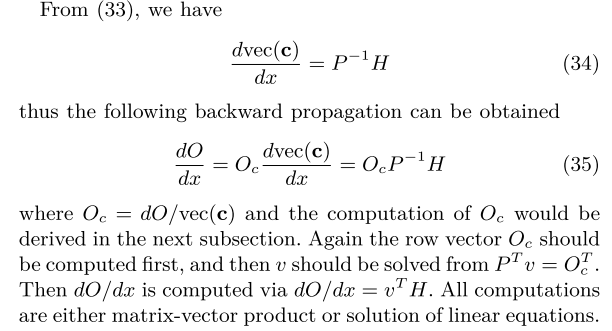
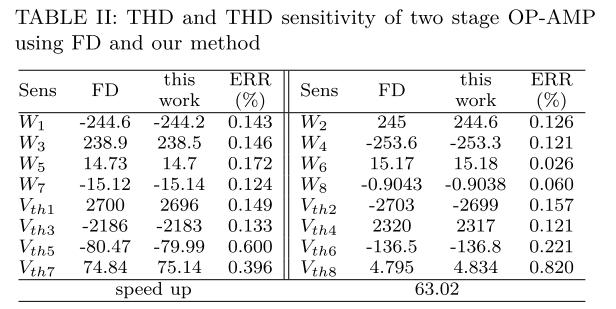

# 多时间点目标函数的伴随瞬态灵敏度分析

前面补充文字。。。。

## 二、背景

### 瞬态分析

文章中：

参考【10】使用：

### 瞬态敏感度分析

（1）求导：

利用x在$t_{n+1}$处的近似离散化：

交换顺序，提取与x不相干项，基于迭代关系，两种方法，向前和向后传播。

目标函数数量远大于参数数量，直接法合适，相当于神经网络的前向传播：

上面为正向迭代，假设目标函数是$X_N$函数，瞬态灵敏度通过

D和M比较大的时候，伴随法比较适合，类似向后传播：

## 三、多时间灵敏度

所有时间点目标函数的灵敏度：

对（10）链规则：

重写（5）：

从（11）的单项，考虑如下：

（11）可以被改写成：

也可以改写成（16）的形式：

(21) 的计算复杂度为0 (N)，与原来相比大大降低。

## 四、时频转换

本节中，我们重点计算对于涉及时频转换的目标函数，如THD、SNDR和SFDR。

傅里叶分析的典型过程包括以下步骤[12]:

​		1)将积分分解为积分和，每个时间步一个；

​		2)采用三次样条插值，用分段多项式逼近波形，得到多项式系数c;

​		3)分析计算每个时间步长的傅里叶积分;

​		4)对各阶、各时间步的积分求和，得到频率谐波

在获得谐波之后，性能指标可以通过以下方式：

进行有效的伴随瞬态灵敏度分析的关键不仅在于计算时频转换，而且在于计算其反向梯度传播。

**参考使用**：谐波

在复杂的周期性振荡中，包含基波和谐波：

由傅里叶级数可知任何周期信号可以分解为：a0+a1cosw0t+a2cosw0t+…+b1sinw0t+b2sinw0t+… 的形式。

基波（一次谐波）：其频率是信号的主要频率(基频)，在音频中，它是一个声音中最低得频率，基波决定了声音的音调。周期最大（频率最小）且幅度最大的那个就是基波。

谐波：其频率比信号的主要频率高，频率等于基本频率的整倍数的正弦波分量，如基频为50Mhz(一次谐波的频率)，则谐波出现在100Mhz,150Mhz…（基频的整数倍）

**参考使用**：THD、SNDR和SFDR是ADC常用的指标。

SNDR 是用于衡量数据转换器的动态性能的关键参数之一，因为 SNDR 包含奈奎斯特带宽上的所有噪声和杂散。SNDR 说明的是输入信号的质量；SNDR 越大，输入功率中的噪声和杂散比率越小。

### A 三次样条插值

插值使目标波形的分析集成成为可能。在本节中，我们考虑三次样条插值[14]，因为它通常用于电路仿真。在三次样条插值中，相邻时间点之间的波形表示为以下多项式：

将参数$t_n, t_{n+1}$值代入上式得到如下：

利用左右两个三次函数的一阶导数，二阶导数，在当前样本点处的值相等，代入得：

三阶导数在在边界点为0：

给定波形x和时间点t，多项式系数c可以用上述方程求解。上述方程的矩阵表示为

**参考**：

### B 傅里叶积分

现在通过傅里叶积分，探究$O_C$:

修改格式：

用积分和归纳法，得到如下等式，再化简（38）：

式(41)给出了反向传播中的关系式如下：

目标函数SNDR, THD, SFDR有相近格式：

此时分子和分母都是某些谐波分量的和，则有

### C 总体算法

反向传播可以通过组合（35）、（43）和（45）来计算，总结了SNDR, THD, SFDR等瞬态灵敏度分析的框架。

## 五、实验结果

### A  Voltage Source

我们将电压源频率设为f，并将电流源频率设为其倍数，使电阻电压为总电路电压中的谐波部分。因此，我们可以计算SNDR、THD的理论值，以及它们对电阻值的灵敏度。我们还用有限差分(FD)方法作为对比，在一些不易获得理论值的电路上验证了我们的方法。表1显示了当电阻电压为电压源值的一半时，上述方法的差异。

值得注意的是，理论值与计算值之间的相对误差(RE)均小于0.6‰。我们的方法在计算灵敏度方面具有明显的优势，而它们使用相同的方法来获得sndr和THDs。结果表明，在计算状态对参数的灵敏度时引入的误差要小得多。

### B  Two Stage OP-AMP

为了阐明该方法的精度和优点，我们使用了一个简单的两级运算放大器，使用180nm模型，其增益大于50dB。电路原理图如图2所示。以下电路的理论值很难获得，因此我们选择FD方法作为对比。

我们得到每个状态的灵敏度表格然后以时间点计算目标函数的灵敏度作为旧方法进行比较。我们的方法获得了近63.02的加速，而结果非常接近。当仿真时间较长或时间步长较小时，以获得更精确的傅里叶结果时，这种优势将更加明显。

### C  rail-to-rail OTA

这个例子是一个轨道到轨道的两阶段OTA，如图3所示。主放大器包括一个折叠级联放大器和一个以电流源为负载的典型放大器。在它们之间设计了相位补偿。我们使用3倍的电流反射镜来实现轨对轨输入电路的放大管几乎恒定的跨导。稳定的共模输出电压由共模反馈放大器实现，不需要轨对轨。

表3显示了使用的电路的THD和THD灵敏度FD和我们的方法。需要注意的是，M26和M50是整个电路中重要的MOSFET，它们的灵敏度要比其他的精确得多，这有利于后期的优化。与旧方法相比，我们的方法实现了近147.18的加速。

## 六、结论

本文提出了一种适用于多参数多时间点问题的瞬态灵敏度分析方法。这加快了与数千个时间点相关的性能指标的分析，几乎没有准确性损失。傅里叶积分变换和三次样条插值帮助我们获得更好的精度。我们在几个电路上演示了我们的方法，并将结果与RE结果进行了比较。这可以在以后的电路优化中采用，从而提供有效的预测。

## 参考文献 

1）谐波：https://blog.csdn.net/weixin_39107270/article/details/129593325

2）THD、SNDR和SFDR： https://blog.csdn.net/mr_jerk/article/details/119532520

3）信号处理：三次样条插值原理详解：https://blog.csdn.net/weixin_40583722/article/details/122809707

4）三次样条插值原理及openCV实现三种边界条件

