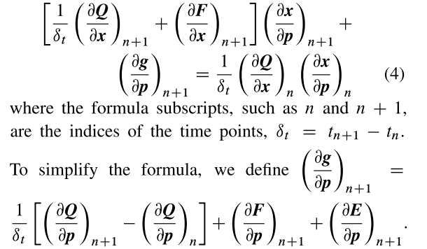
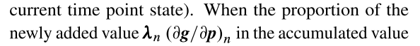

# 一种多时间点相关目标函数的早期停止伴随瞬态灵敏度分析方法

## 摘要

​		暂态灵敏度分析的目的是在模拟器中获得目标函数(电路性能)相对于设计或变化参数的梯度，可广泛应用于良率分析和电路优化等领域。然而，对于包含N个时间点电路状态的目标函数，传统方法的计算复杂度为O(N^2)。当N值较大时，计算量太大，特别是在时频变换中。本文提出了一种多时间点灵敏度方法，将多参数多时间点情况下的计算复杂度降低到O(N)。本文给出了一种通过加权传输链和复用反向传播过程来提高效率的推导过程。为了在保证精度的前提下进一步提高效率，我们还提出了一种提前停止的方法。该算法可以对涉及数千个时间点的性能进行灵敏度计算，如信噪比和失真比以及总谐波失真，速度显著提高。

## 介绍

​		暂态分析是一种重要的仿真方法，可以用来找出给定电路的时域响应。暂态分析的目标函数可以是当一个事件被触发时电路的状态，如延迟，或可能涉及在不同时间点的许多电路状态，如平均电流、信噪比和失真比(SNDR)、总谐波失真(THD)、无杂散动态范围(SFDR)等都涉及时频变换。与多个时间点相关的目标函数的暂态分析也是数模转换器(DAC)、模数转换器(ADC)和运算跨导放大器(OTA)等电路的重要性能指标。

​		进行瞬态灵敏度分析以计算目标函数(电路性能)相对于设计或变化参数的梯度。在模拟器内计算瞬态分析时获得梯度，不需要外部参数改变或额外的模拟。

​		灵敏度对于良率分析[5-7]、电路优化[8-10]和性能建模[11-14]特别有价值，因为它们可以提供梯度信息，指导许多强大的算法[15-18]。在实际电路应用场景中，每一次数据采集在优化中都意味着一次时间消耗晶体管级仿真。然而，不基于梯度的启发式算法(如差分进化和遗传算法)通常需要在优化过程中进行大量的迭代和数据，才能根据经验找到最优值。基于梯度的确定性算法由于在梯度方向的引导下快速收敛，可以快速找到最优值，节省了大量的仿真。然而，灵敏度分析还需要仿真资源，这使得新引入的灵敏度计算复杂度显得尤为重要。

​		暂态灵敏度的计算主要采用两种方法:沿时间轴正向传播的直接法和反向传播的伴随法[19-21]，这是由于矩阵计算的复杂性。直接法更适合于目标函数远大于电路参数的情况，伴随法更适合于参数远大于目标函数的情况，因为需要进行矩阵计算和存储[22]。伴随法更适合于电路应用，因为在实际设计中有大量的参数是正常的。然而，对于具有多个时间点电路状态的目标函数，其计算成本过于昂贵。

​		为了提高效率，人们提出了许多方法，尤其是伴随法。将原电路的数值积分格式拟合为多项式，提出了一种时间展开伴随灵敏度法[23]。然而，它需要额外的内存来存储轨迹。有向无环图法[24]用简单、优雅的方法解释了敏感性分析理论。本文还讨论了事件驱动目标函数的灵敏度分析，以处理更一般的电路性能情况。BLAST[25]是一种基于质心拉格朗日插值的方法。

​		本文提出了一种多时间点灵敏度(MTPS)方法，该方法适用于多参数多时间点目标函数的瞬态灵敏度分析。我们添加了将伴随方法的状态对参数反向传播的敏感性系数(BP)从 O(N^2) 降低到 O(N) 。为了在MTPS的基础上进一步提高效率，提出了在可容忍的误差范围内减少BP的迭代次数的提前停止方法。与单一的瞬态灵敏度分析相比，所提出的方法基本上适用于所有目标函数，并且附加成本相对较低。采用傅里叶积分变换和三次样条插值，尽量避免了额外的时间点计算和信号的混叠。在涉及时频变换的典型电路中进行了SNDR和THD灵敏度实验，证明了该方法的有效性。

​		本文的其余部分组织如下。在第2节中，我们介绍了瞬态分析和瞬态灵敏度分析的背景。在第3节中，我们介绍了多时间点瞬态灵敏度分析的动机，并提出了MTPS法和早停法来解决这一问题，提高效率。在第4节中，我们提出了一种基于三次样条插值和傅立叶积分的时频变换。在第5节中，我们进行了实验来说明所提出方法的有效性。最后，我们在第6节中得出结论。

## 二、背景

### 2.1 瞬时分析

​		在仿真器中，用一组基于基尔霍夫电流定律、基尔霍夫电压定律和电压电流关系定律的数学方程对实际电路进行暂态分析。因此，暂态分析的实质是在时域内求解方程在一定周期内的解。方程为微分代数方程(DAE)

​	暂态分析的主要流程如下:(1)得到了电路网络表和相应的模型。(2)基于修正节点分析等方法，将实际电路自动描述为数学方程。(3)初始化时间步长，使连续时间离散化。(4)在每个时间点，采用后向欧拉算法、GEAR算法等数值积分方法将DAE转化为差分方程;即下一个时间点的未知量通过递归过程求解[28,29]。(5)重复上述步骤，直至最后一个时间点。暂态分析的起始点一般由直流工作点分析得到。在上述流程中，时间步长(时间离散后相邻时间点之间的长度)通过局部截断误差(local truncation error, LTE)来计算[30]，以保持整个波形的精度。采用阻尼牛顿法等迭代法求解各时间点的非线性方程。

### 2.2瞬态灵敏度分析

​		以反向欧拉法[31]离散时间为例。根据时间索引对公式中的每一项进行排序，提取与x不直接相关的项。那么，DAE的导数为

​		式(4)的左右两侧分别为第n个c1和n个时间点的数据。根据迭代在迭代方向上，暂态灵敏度分析可分为正向(从n到nC1)直接法和反向(从nC1到n)伴随法两种方法。

​			在目标函数较少，参数较多的情况下，P是一个较大的数字，使用上述方程作为一个大而密集的矩阵来存储或计算的代价太大。在这种情况下，伴随法比直接法更适用。该方法从最后一个时间点N开始迭代，灵敏度可计算为

它是一个小矩阵，其中Z是目标函数(电路特性)的个数。从N到0的累积求和避免了@x=@p作为一个大而密集的矩阵的计算和存储。实际电路可能有很多节点，参数的数量也很大。例如，在良率分析中可能会发现数千个工艺参数。因此，我们在后期的敏感性分析中采用伴随法。

​		但是，当目标函数涉及多个时间点的电路状态时，伴随灵敏度分析仍然存在计算复杂度的问题，因为每个时间点的数据需要按照式(6)进行计算。如果涉及N个时间点，则Eq.(6)需要执行N次，而使用伴随方法计算复杂度为O(N)的求和过程。因此，传统方法的计算复杂度为O(N^2)，对于较大的N，特别是对于时频变换的目标函数，计算代价太大。

## 3.1 .多时间点灵敏度

### 3.1 Motivation 

​		ADC和DAC是实现模拟和数字信号相互转换的电路。它们是连接模拟电路和数字电路的重要桥梁。SNDR、THD和SFDR是设计人员必须测量的必要性能指标，需要进行时频变换。例如，SNDR决定了ADC的理论有效位数，因为当ADC产生的噪声太大而无法与信号区分时，ADC编码可能会出错。需要在较长时间内的感兴趣的电路节点的信号来确保这些电路的准确性能。然后，通过傅里叶变换将其转换成频域信号，计算最终性能。

​		这些目标函数涉及数千个时间点，灵敏度计算复杂度O(N2）太大。时域信号通常非常小。因此，利用模拟器产生的所有时间点数据来计算频域信号，以提高傅里叶变换的精度。这种做法使成本更难以接受。

​	因此，我们着重于目标函数的暂态灵敏度分析。与多个时间点的电路状态有关的多参数，即。。。。

### 3.2 Multi-time points sensitivity

同之前；

### 3.3 Early-stop Adjoint

​		伴随瞬态灵敏度分析需要从N个时间点到初始点的BP来计算准确的灵敏度。如式(21)所示，灵敏度计算需要累加和N，因为电路状态不仅由当前时间点决定，还受之前时间点的影响。在大多数电路中，距离感兴趣的时间点较近的时间点的状态往往具有较大的影响，而距离较远的时间点的影响较小。因此，我们提出可以根据数据积累的变化提前终止BP，并在O(N) 的基础上降低计算复杂度，称为提前停止法。

​      目标函数的灵敏度是当目标函数仅与一个时间点的状态相关时，连续反向传播过程中的累计值。如果新增值对于累积值相对可以忽略，则可以终止BP，并将当前累积值作为最终灵敏度。

​	   当目标函数只与一个时间点的状态相关时，基于早停法的伴随瞬态灵敏度公式为:

​       当目标函数与多个时间点的状态相关时，灵敏度为BP过程中多个新触发分支的累积值。

上述2种条件下，早停。我们只判断加权积累后的新增增加值和总积累值是否满足截止条件，而不是判断每个加权分支是否满足截止条件。只有计算出所有感兴趣的时间点，并满足提前停止截止条件，程序才能跳出整个BP并终止。因此，基于早停法的伴随瞬态灵敏度公式可表示为：

​		提前停止法可以在满足精度要求的前提下，减少仿真器中BP的迭代次数，加快灵敏度计算速度。因此，基于O(N) /可以降低计算复杂度，具体复杂度由截止条件、reltol和Nes决定。

## 四、时频转换

后续同之前：

 

