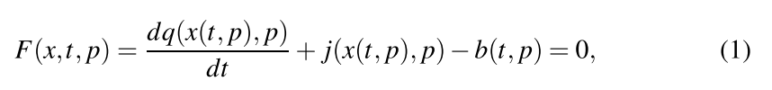
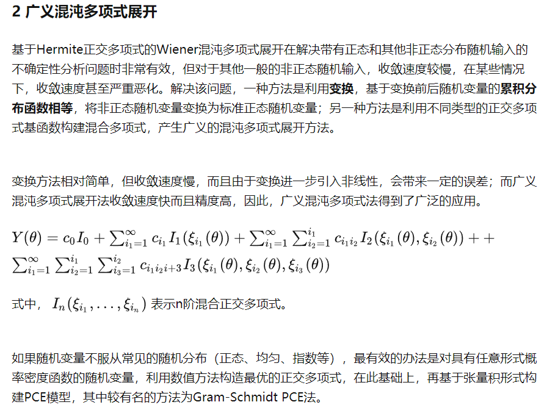

# 电路仿真中的梯度增强多项式混沌方法

## 一、介绍

​        灵敏度分析和不确定度量化(UQ)是电路仿真的重要功能。在本文中，灵敏度是指目标函数对参数的导数。这些参数灵敏度给出了在特定点控制响应的重要参数的局部指示。UQ允许人们理解响应的概率分布，给定输入参数的概率分布。

​       采样方法通常用于执行UQ。虽然抽样是一种吸引人的方法，有几个原因(例如，给定一个特定的种子，它是可重复的，在某种意义上它是容错的，可以放弃失败的样本评估，而且很容易理解)，抽样受到维度的诅咒。这意味着平均需要四倍的样本点数N才能使误差减半。尽管已经开发了许多改进的采样方案来克服这些限制，例如拉丁超立方体采样[1,2]和空间填充设计，但采样的本质局限性仍然存在。

​    	计算模拟社区最近的兴趣是使用更多的“嵌入式”UQ方法，其中UQ算法被侵入式地内置到模拟器中。作为示例，文献[3]在电路模拟器中演示了一种基于侵入式伽辽金的多项式混沌展开(PCE)方法。然而，实现需要对设备模型进行大量的检测，这在大多数生产模拟器中是不切实际的。

​		有几种UQ方法需要对模拟器进行一些修改，但与完全侵入式galerkin PCE所需的修改相比，所需的修改要少得多。具体来说，如果模拟器已经被用来有效地产生参数灵敏度[4-6]，这些可以用来提高几种名义上非侵入式UQ方法的准确性和运行时间[7]。

​		我们概述了这种UQ方法的公式，并演示了当在UQ过程中使用应用程序代码的精确灵敏度时可以获得的计算节省。本文中描述的方法和算法在两个软件框架中实现:Xyce[8]，一个是桑迪亚国家实验室开发的并行电路模拟器，以及Dakota[9]，桑迪亚开发的优化和UQ工具包。两者都是开源软件包，分别可在https://info.sandia.gov/xyce和https://dakota.sandia.gov上获得。然而，应该强调的是，这里提出的算法和方法是通用的，并适用于其他计算领域。

##  二、瞬态敏感性

​		如果应用程序代码能够产生相对于感兴趣的目标函数的参数灵敏度，那么许多UQ技术都可以得到增强。本文对直接瞬态灵敏度和伴随瞬态灵敏度作了简要概述。对于更详细的描述，鼓励读者查看参考文献[4-6]。对于这项工作，我们的兴趣是用微分代数方程(DAE)形式表示的瞬态动力系统:

其中$x∈R^{n_x}$为DAE解，对于所有p满足F = 0。在电路仿真中，x由节点电压和支路电流组成。$p∈R^{n_p}$是一组输入参数。q和j分别是表示动态和静态电路元件的函数，$b(t)∈R^{n_x}$是输入向量。在电路分析中，q主要包含电容电荷项，j包含电阻项，b包含独立的电流和电压源。因此，q, j和b由电路模拟器支持的各种电路元件模型(也称为“紧凑模型”)填充。方程(1)的瞬态分析需要隐式时间积分方法，如后向欧拉(BE)或梯形规则。$F∈R^{n_x}$是残差方程向量，它在每个时间步上通过牛顿法最小化来解出x。

​		我们还对动力系统的目标函数$O(x, p)∈R^{n_0}$感兴趣优化。对于电路仿真，目标函数可以是电路输出电压，或者更复杂的东西，比如信号延迟。灵敏度是O对p的导数，可以用链式法则表示:

其中x和F的含义与Eq.(1)相同。Eq.(2)的右边包含几个矩阵的乘积，每个矩阵都有不同的维数。∂O/∂x的维数是$n_O×n_x$。雅可比矩阵∂F/∂x的维数为$n_x×n_x$，通常可以在任何使用隐式方法求解Eq.(1)的模拟器中使用。导数向量∂F/∂p被称为“函数导数”，维度为$n_x×n_p$，必须由各种紧凑的设备模型填充。在现代电路模拟器中，由于具有复杂的设备紧凑模型，计算∂F/∂p可能具有挑战性，并且可能仅适用于自动微分(AD)。为此，Xyce使用Sacado AD库[10]。

​		灵敏度可以用两种不同的方法计算;直接法和伴随法。直接式和伴随式之间的差异与公式(2)项的计算顺序有关。对于具有大量参数$n_p$和少量目标$n_O$的问题，伴随方法通常更有效。对于相反的情况，直接法是更好的选择。瞬态直接灵敏度和伴随灵敏度分别在第2.1节和第2.2节中简要介绍。

### 2.1  瞬态直接灵敏度

​		瞬态直接灵敏度可以按照Hocevar[4]描述的方法推导。对于任何积分方法，可以通过将原始DAE (Eq.(1))对参数p求导得到瞬态直接灵敏度DAE方程:

​		利用隐式时间积分法得到了方程(3)的数值解。如果使用BE，则通过将BE公式替换为dq/dt并使用链式法则展开q和j导数来确定扩展的直接灵敏度DAE方程(例如dq/dp =∂q/∂x·∂x/∂p+∂q/∂p)。这给了

​		式中i为时间步长指数，$h_i$为从步骤i−1到步骤i的时间步长。其他积分方法也可以导出类似的公式。在原始DAE的牛顿环收敛后，在每个时间步解出式(4)。方程(4)左侧的雅可比矩阵与原始DAE解中使用的雅可比矩阵相同，因此可以简单地重复使用。请注意，Eq.(4)右侧的“函数导数”相当于Eq.(2)中的$∂F/∂p$，而Eq.(4)中的雅可比矩阵相当于Eq.(2)中的$∂F/∂x$。

### 2.2  瞬态伴随灵敏度

​		瞬态伴随灵敏度[5,6]大致可分为两类:离散伴随灵敏度(将直接灵敏度DAE离散化后应用伴随算子)和连续伴随灵敏度(先应用伴随算子，再进行离散化)。为简洁起见，本文描述离散伴随形式[5]。

​		对于离散瞬态伴随情况，用分块矩阵形式考虑整个瞬态是方便的。如果一个瞬态仿真由N个时间点组成，那么所有的时间点都可以考虑在

其中，F是由$F = [F_0,F_1，…，F_N]^T$给出的块残差向量。方程中的其他项:X、˙Q、J和B分别是原始DAE方程项:X、Q、J和B的块类比。对于传统的时间积分方法，分块雅可比矩阵为下三角分块矩阵:

$Θ= {[Θ_0，Θ_1，…，Θ_N]}^T$是$X= [x_0,x_1，…x_N]^T$的导数，相对于参数值p，例如$Θ_0 = dF_0/d_p$。块矩阵呈带状，上三角形。直观地说，解决这个块线性系统需要从矩阵的左上角(在第一个时间点)开始，并使用前向替换来解决这个系统。这样做类似于对时间进行前向积分。对于BE，式(6)中第i行块对应的等价方程为

当残差F用BE展开时，式(8)等价于式(4)。∂Fi/∂xi是雅可比矩阵，∂Fi/∂p是函数导数，∂Fi/∂xi−1是非对角线的块矩阵，或“链式法则”项。

​	通过对Eq(6)进行转置，可以得到离散伴随矩阵的形式。得到的块雅可比矩阵具有上三角矩阵的形式:

​		对于瞬态伴随灵敏度，需要先将整个时间范围内的原始DAE (Eq.(1))完全解出，然后再求解伴随方程得到灵敏度。为了填充Eq.(9)中的雅可比矩阵和Eq.(12)中的函数导数，必须在正解过程中保存信息。对于长瞬态，这可能需要大量的存储，这是瞬态伴随的缺点。

## 三、多项式混沌展开方法

​		随机展开UQ方法通过在多项式基础上展开来近似模拟响应对不确定模型参数的泛函依赖[11,12]。所使用的多项式是为不确定参数的表征量身定做的。PCE是基于一个多维正交多项式的近似。

​		在PCE中，输出响应被建模为使用一组精心选择的多项式的输入随机变量的函数。例如，PCE采用Her- mite多项式对高斯随机变量建模，这是Wiener最初采用的方法[13]。Dakota使用Wiener- Askey方案实现了广义PCE方法[11]，其中使用Hermite、Legendre、Laguerre、Jacobi和广义Laguerre正交多项式分别对高斯、均匀、指数、beta和gamma概率分布描述的连续随机变量的影响进行建模。这些正交多项式的选择对于这些分布类型是最优的，因为内积加权函数响应于这些连续分布的概率密度函数。

​		为了通过使用PCE的模型传播输入不确定性，Dakota执行以下步骤:(1)将输入不确定性转换为一组不相关的随机变量，(2)选择Hermite多项式等基，(3)确定函数逼近的参数。回应O的一般PCE格式为:

​		其中每个多元基多项式Ψj(p)涉及针对单个随机变量量身定制的单变量多项式的乘积。响应O类似于第2节中描述的目标函数O，除了这里的输入参数p被认为是随机变量，而在第2节中它们被认为是确定性的。如果使用全阶多项式基(例如，总阶为2的基包含指数小于或等于2的项，如$p_1^2$、$p_2^2$和$p_1{p_2}$，但不包括$p_1^2{p_2^2}$)，则对于包含N个不确定输入变量的响应函数，任意阶k的PCE中N项的总数为:(N +k)!/(N !k!)另一方面，如果在每个维度上使用k阶的各向同性张量积展开，则项数为$(k+1)^n$。如果展开的k阶捕获了真实函数的行为，则PCE方法将给出非常准确的响应输出统计结果。

​		在非侵入式PCE中，如在达科他，模拟被用作黑盒，感兴趣的响应指标的扩展系数αj的计算是基于一组模拟响应评估。为了计算这些响应PCE系数，使用了两类主要方法:谱投影和回归。谱投影法利用内积对各基函数Ψj(p)的响应进行投影，并利用多项式正交性提取各系数。每个内积都涉及加权函数支持范围内的多维积分，可以使用采样、张量积正交、Smolyak稀疏网格[14]或cubature[15]方法对其进行数值计算。PCE方法的一个优点是其收敛速度[12]。对于L2中的光滑函数(即解析的，无限可微的)(即具有有限方差)，对于感兴趣的积分统计量(如均值和方差)，可以在有序细化下获得指数收敛率。非侵入式PCE方法的一个缺点是它们可能无法很好地扩展到高维。最近对自适应细化和稀疏恢复方法的研究努力解决这一限制[16]。

​		在这项工作中，我们使用基于回归的PCE方法，基于回归的PCE方法旨在解决线性系统

回归方法在不确定参数的密度函数上找到一组最能匹配从抽样研究(例如，计算机实验设计产生样本点的非结构化网格，有时称为搭配点)中获得的一组响应值的PCE系数α[17]。研究了基于回归的PCE方法的收敛性。可以通过使用由采样点组成的随机矩阵的谱半径的界限来限定识别PCE展开中系数所需的样本数量[18]。收敛性分析的重点是样本数量和采样方法的稳定和准确的解恢复。使用相干参数的概念，它是实现的光谱半径ofWΨ的一个界，其中w是一个对角的正定矩阵。使用回归PCE的PCE系数的解恢复可以保证样本的数量与相干性乘以J的对数因子成正比，J是基多项式的总数。在某些情况下，恢复PCE系数所需的样本数量与基多项式的数量呈线性或近线性关系[18]。

​		通过使用来自每个搭配点的导数信息(梯度和Hessians)可以获得额外的回归方程，这可以帮助根据随机变量的数量进行缩放，特别是对于基于伴随的导数方法。这一思想是本文研究的主要内容。将导数方程加入到回归方程集中如下:

​	    Eq.(15)只是PCE响应方程(Eq.(13))对UQ分析的随机变量的导数。理想情况下，左手边由模拟器进行灵敏度计算，如第2节所述。

​	   求解Eq.(14)可以采用多种方法。每种方法的相对准确性取决于问题。传统上，最常用的方法是最小二乘回归。然而，当Ψ不确定时，最小化相对于L2范数的残差通常会产生较差的解。压缩感知方法已经成功地用于解决这一限制[19,20]。这样的方法试图只识别系数向量α中具有最大幅度的元素，并强制尽可能多的元素为零。这样的解通常被称为稀疏解。

​		最近对梯度增强回归PCE的收敛性进行了研究[21]，作者表明，包含导数信息和适当的归一化几乎肯定会改善这种成功的解恢复的条件。文献[21]给出了基于回归的带有导数信息的Hermite PCE的解恢复的理论概率边界。这项工作表明，在回归公式中加入梯度将以更低的总体计算成本提高解决方案的恢复。

​		Dakota提供了几种解决PCE回归公式的算法，包括正交匹配追踪、最小角度回归(LARS)、最小绝对收缩(LASSO)、基追踪和标准最小二乘。通常，我们建议对过度确定的系统使用最小二乘法，对欠确定的系统使用压缩感知方法，这是当基函数用表示梯度项的附加基函数进行扩充时的情况。这些方法的细节记录在达科塔理论手册的线性回归部分[22]

**参考**：UQ方法

**参考**：多项式混沌展开

**参考**

## 四、CMOS逆变电路的结果

​		在本节中，我们演示了在五级CMOS逆变器上使用梯度增强PCE方法(图1)。该电路使用了10个BSIM6[23]紧凑型模型实例，该模型在Xyce中使用AD[10]来提供分析参数灵敏度(第2节中描述的“函数导数”术语)。唯一的其他电路元件是阶跃输入电压源。待解系统有60个未知量，其中大部分为节点电压。dq/dx雅可比矩阵是奇异的，所以这个系统是一个纯DAE系统。晶体管模型都包括非线性电容。来自第一个逆变器的电容与理想电压源输入形成环路，这意味着电路的DAE指数为2[24,25]。

​	   在数字电路中，信号延迟是一个重要的性能指标。电容效应是重要的延迟贡献者，在本电路示例中，每个逆变器级主要通过栅氧化电容器增加信号延迟。栅极氧化层厚度(这里称为δ)因此是一个关键的不确定参数，为指定为BSIM6的参数输入。在本研究中，假设所有5个NMOS器件具有相同的δN，假设所有5个PMOS器件具有相同的δP，给出2个不确定的标量参数。我们将这些建模为高斯分布的不确定性，以标称值为中心，标准差为标称值的10%。δN和δP的平均值分别为1.74E-9m和2.34E- 9m。我们使用的其他非不确定晶体管参数取自BSIM6基准测试。

​		感兴趣的输出是输出电压evout，正向Xyce计算的结果如图2所示。左图显示了输入节点、第三个逆变器输出节点和第五个逆变器输出节点(Vout)的瞬态电压。在一个理想的电路中，输入和输出转换之间没有延迟，但在这个更现实的电路中，情况并非如此。在阶跃输入后，输出电压从高电平到低电平有一定的延时，每个逆变器都给信号增加了额外的延时。Vout对δN和δP的灵敏度如图所示。两者都在Vout过渡时期急剧达到峰值。在本例中，np = 2，因此使用直接法(2.1节)计算灵敏度。然而，伴随方法(第2.2节)产生相同的结果。

我们使用各种UQ技术在CMOS电路上执行UQ。作为基线，我们对100个和1000个样本进行了LHS。然后，我们对两个输入参数中的每一个使用5阶的全张量积正交进行PCE，需要25个样本点。最后，我们进行了两种基于回归的PCE:第一种，我们使用了30个没有梯度的样本。在第二种情况下，我们使用了10个样本，其中每个样本包含两个梯度值，dTD/dδN和dTD/dδP。因此，最后一次PCE计算使用了30条信息，与没有梯度的30个样本回归PCE相当，但只需要10个样本。

在进行不确定性分析时，灵敏度的使用在图3和表1中突出显示。如图所示，对于大小为1000的LHS样本和所有PCE方法，给出TD小于特定值的概率的累积分布函数(CDF)几乎是相同的。LHS 1000和所有PCE变体的CDF曲线相互覆盖。唯一明显不同的是100个样本的LHS结果。表1显示了平均TD值非常相似，只是第五位有效数字不同。最后，标准差显示出更多的可变性，但同样是相当接近的。我们得出结论，使用xyce(10个PCE回归案例)的灵敏度的PCE与1000个LHS样品的形式相当。包括梯度会增加每个样本的成本，但对于小问题来说，这个额外的成本可以忽略不计。对于较小的nx，线性解少于总运行时间的10%。因此，每个直接灵敏度时间步长的两个额外线性解不会产生太多的计算开销。

## 结论

​		本文探索了一种基于梯度增强PCE的电路级UQ的新方法。PCE是一种非采样、基于投影的技术，其中参数不确定性使用正交多项式的展开来逼近。基于回归的PCE可以通过仿真器的参数灵敏度来增强，从而可以在更少的样本下获得相似的精度。本文描述了瞬态灵敏度，并证明了这些灵敏度在梯度增强PCE中的成功应用。

## 参考文献

1）混沌多项式：https://zhuanlan.zhihu.com/p/414661101

2）混沌多项式展开法(PCE法)概述：https://zhuanlan.zhihu.com/p/40853397

3）稀疏偏最小二乘回归-多项式混沌展开代理模型方法：https://www.engineeringmechanics.cn/HTML/20180906.shtml

